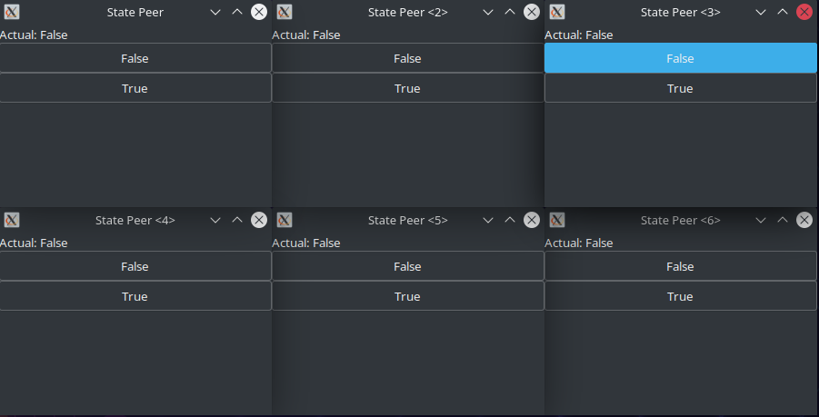

# SimplyP2P
SimplyP2P is a simple Peer-to-peer network that synchronize a common boolean state between all peers and show the current state in a GUI, with some buttons to change its value in all peers.
the reference value is the time expressed as unix timestamp, if the value is greater than that of the currently contained value, the status of current node is updated, otherwise the update will be discarded because it is considered obsolete.

## Warning
This project is fully working, and the crash problem has been resolved.
State updates are instant and are received by all peers.

However, the GUI library used is in a mid alpha state and was chosen because it is simple to use and very light: it's used to show the current state of the system and allow you to modify it.

## Requirements
Gtk+-3.0 dev is necessary to run this project.
If you have an Ubuntu-based distro and don't know how to install it, use the command below.
```
sudo apt install libgtk-3-dev
```

## Run and build
Use the localTest.go example in the cmd directory if you want to test this library easily using `go run` or `go build`.

The alternative is to make your own main executable importing this module in your project or use its functions as a library.
Check the [documentation](https://pkg.go.dev/github.com/ErikPelli/SimplyP2P)!

## Test
True button:


False button:
